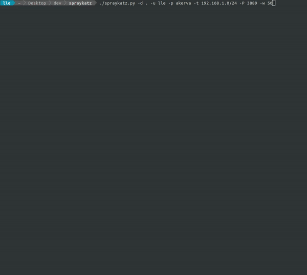

<h1 align="center">
  <br>
  <a href="https://github.com/aas-n/spraykatz/"></a>
  <br>
  Spraykatz
  <br>
</h1>

<h4 align="center">Spray love around the world</h4>
<p align="center">
  <a href="https://github.com/aas-n/spraykatz">
    
  </a>
  <a href="https://twitter.com/aas_s3curity">
    
  </a>
  <a href="https://akerva.com">
    
  </a>
</p>


### Index
| Title        | Description   |
| ------------- |:-------------|
| [About](#about)  | Brief Description about the tool |
| [Installation](#installation)  | Installation and Requirements |
| [Usage](#using-spraykatz)  | How to use Spraykatz |
| [Changelog](#changelog)  | Spraykatz changelog |
| [Acknowlegments](#acknowlegments)  | Acknowlegments |

### About 
Spraykatz is a tool without any pretention able to **retrieve credentials** on Windows machines and large Active Directory environments.

It simply tries to __procdump__ machines and __parse dumps remotely__ in order to **avoid detections** by antivirus softwares as much as possible.

### Installation
This tool is written for **`python3 to python3.6`**. Do not use this on production environments!
#### Ubuntu
On a fresh updated Ubuntu.
```bash
apt update
apt install -y python3.6 python3-pip git nmap
git clone https://github.com/aas-n/spraykatz.git
cd spraykatz
pip3 install -r requirements.txt
```

### Using Spraykatz
A quick start could be:
```bash
./spraykatz.py -u H4x0r -p L0c4L4dm1n -t 192.168.1.0/24
```

<h3 align="center">
  <a href="https://github.com/aas-n/spraykatz"></a>
</h3>

#### Mandatory arguments
| Switches | Description |
| -------|:--------|
| -u, --username | User to spray with. He must have admin rights on targeted systems in order to gain remote code execution. |
| -p, --password | User's password or NTLM hash in the `LM:NT` format. |
| -t, --targets | IP addresses and/or IP address ranges. You can submit them via a file of targets (one target per line), or inline (separated by commas). |

#### Optional arguments
| Switches | Description |
| -------|:--------|
| -d, --domain | User's domain. If he is **not** member of a domain, simply use `-d .` instead. |
| -r, --remove | Only try to clean up ProcDump and dumps left behind on distant machines. Just in case. |
| -v, --verbosity | Verbosity mode {warning, info, debug}. Default == info. |
| -w, --wait  | How many seconds Spraykatz waits before exiting gracefully. Default is 180 seconds. |

### Changelog
```
Version 0.9.9
=============
- Removing impacket submodules (just use pip).

Version 0.9.8
=============
- ProcDump binaries are not embedded anymore. Spraykatz ask for downloading them now.

Version 0.9.7
=============
- adding the "-r" switch to remove procdump & dumps left behind, just in case.
- adding the "-w" switch to specify a timeout before exiting gracefully.
- Debug mode enhanced
- Bugs fixes
```

### Acknowlegments  
Spraykatz uses slighlty modified parts of the following projects:
* [Impacket](https://github.com/SecureAuthCorp/impacket)
* [Pypykatz](https://github.com/skelsec/pypykatz)
* [Pywerview](https://github.com/the-useless-one/pywerview)
* [Sysinternals](https://docs.microsoft.com/en-us/sysinternals/downloads/)

Thanks:
* [Gentil Kiwi](http://blog.gentilkiwi.com/)
* [hackndo](https://beta.hackndo.com/)

#
Written by [aas](https://twitter.com/aas_s3curity)
